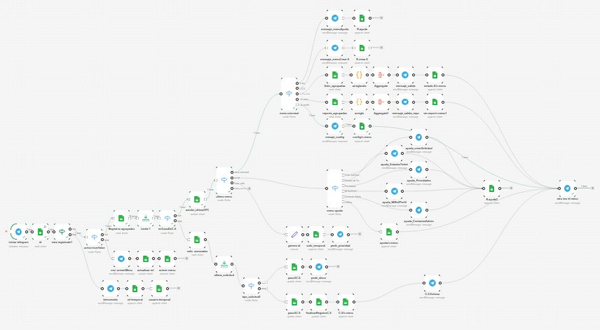

[README.md](https://github.com/user-attachments/files/27210912/README.md)
# 🤖 HelpDeskBot — Sistema de Gestión de Tickets por Telegram

> Automatización completa de soporte técnico vía Telegram, construida con **n8n**, **Google Sheets** y lógica de estado persistente por usuario.

---

## 📋 Tabla de Contenidos

- [Descripción General](#descripción-general)
- [Arquitectura del Sistema](#arquitectura-del-sistema)
- [Diagrama del Flujo](#diagrama-del-flujo)
- [Módulos y Nodos](#módulos-y-nodos)
  - [Módulo 1: Entrada y Autenticación](#módulo-1-entrada-y-autenticación)
  - [Módulo 2: Gestión de Estado](#módulo-2-gestión-de-estado)
  - [Módulo 3: Menú Principal](#módulo-3-menú-principal)
  - [Módulo 4: Centro de Ayuda](#módulo-4-centro-de-ayuda)
  - [Módulo 5: Crear Solicitud (Flujo Multi-Paso)](#módulo-5-crear-solicitud-flujo-multi-paso)
  - [Módulo 6: Consulta de Solicitudes](#módulo-6-consulta-de-solicitudes)
  - [Módulo 7: Reportes de Actividad](#módulo-7-reportes-de-actividad)
  - [Módulo 8: Configuración](#módulo-8-configuración)
- [Modelo de Datos](#modelo-de-datos)
  - [Hoja: USUARIOS](#hoja-usuarios)
  - [Hoja: REGISTROS](#hoja-registros)
  - [Hoja: SOLICITUDES](#hoja-solicitudes)
- [Flujo de Conversación](#flujo-de-conversación)
- [Lógica de Estado Persistente](#lógica-de-estado-persistente)
- [Requisitos Previos](#requisitos-previos)
- [Instalación y Configuración](#instalación-y-configuración)
- [Credenciales Necesarias](#credenciales-necesarias)
- [Estados de Ticket](#estados-de-ticket)
- [Roles de Usuario](#roles-de-usuario)
- [Decisiones de Diseño](#decisiones-de-diseño)
- [Limitaciones Conocidas](#limitaciones-conocidas)
- [Roadmap](#roadmap)

---

## Descripción General

**HelpDeskBot** es un agente conversacional de soporte técnico completamente funcional que opera sobre Telegram. Permite a los usuarios crear tickets de soporte, consultar su estado, revisar su historial de actividad y acceder a documentación de ayuda, todo desde una interfaz de chat sin necesidad de instalar aplicaciones adicionales.

El sistema está construido íntegramente sobre **n8n** (plataforma de automatización no-code/low-code) usando **Google Sheets** como base de datos persistente. Cada mensaje del usuario desencadena una ejecución del workflow que evalúa el contexto actual, determina en qué "pantalla" se encuentra el usuario y responde en consecuencia.

### ✨ Características Principales

- Registro automático de nuevos usuarios con asignación de rol
- Sistema de navegación por menús basado en estado persistente
- Creación de tickets en **3 pasos guiados** (tipo → prioridad → descripción)
- Generación de ID único por ticket (`Math.random().toString(36)`)
- Consulta de solicitudes con formato enriquecido (HTML en Telegram)
- Historial de actividad completo del usuario
- Centro de ayuda contextual con 5 secciones
- Arquitectura stateful sin necesidad de base de datos externa

---

## Arquitectura del Sistema

```
┌─────────────────────────────────────────────────────────────────┐
│                         TELEGRAM                                │
│              (Canal de entrada y salida de mensajes)            │
└────────────────────────┬────────────────────────────────────────┘
                         │ Webhook (TelegramTrigger)
                         ▼
┌─────────────────────────────────────────────────────────────────┐
│                    CAPA DE AUTENTICACIÓN                        │
│   id → esta registrado? → activo true/false                     │
└────────────────────────┬────────────────────────────────────────┘
                         │
           ┌─────────────┴──────────────┐
           │ Nuevo usuario              │ Usuario existente
           ▼                            ▼
┌──────────────────┐        ┌───────────────────────────────────┐
│  REGISTRO        │        │    CAPA DE ESTADO (Google Sheets) │
│  bienvenida      │        │  Registros agrupados → Limite 1   │
│  rol temporal    │        │  → enCasoDeC.S → actulzr_ultimaOPC│
│  usuario temporal│        └──────────────────┬────────────────┘
│  actualizar rol  │                           │
└──────────────────┘                           ▼
                              ┌────────────────────────────────┐
                              │       ROUTER DE PANTALLAS      │
                              │         "ultimo menu"          │
                              │  menu_principal / ayuda /      │
                              │  crear_solicitud               │
                              └──────────┬─────────────────────┘
                                         │
                    ┌────────────────────┼──────────────────────┐
                    ▼                    ▼                       ▼
             ┌──────────┐       ┌──────────────┐      ┌─────────────────┐
             │  MENÚ    │       │   CENTRO DE  │      │  CREAR          │
             │PRINCIPAL │       │    AYUDA     │      │  SOLICITUD      │
             │ (Switch) │       │  (5 secciones│      │  (3 pasos)      │
             └──────────┘       └──────────────┘      └─────────────────┘
                    │
       ┌────────────┼────────────┬────────────┐
       ▼            ▼            ▼            ▼
  Consultar    Reportes     Config        Ayuda
  Solicitudes  Actividad    (WIP)
```

---

## Diagrama del Flujo



> **Nota:** El workflow completo contiene **~50 nodos** interconectados. El flujo de datos sigue una arquitectura stateful donde cada ejecución consulta el último registro del usuario en Google Sheets para determinar el contexto actual.

---

## Módulos y Nodos

### Módulo 1: Entrada y Autenticación

Este módulo recibe cada mensaje de Telegram e identifica al usuario.

| Nodo | Tipo | Función |
|------|------|---------|
| `iniciar telegram` | `TelegramTrigger` | Webhook que recibe todos los mensajes del bot. Escucha el evento `message`. |
| `id` | `GoogleSheets` (Read) | Busca al usuario en la hoja **USUARIOS** filtrando por `telegram_user = message.from.id`. Siempre retorna datos (alwaysOutputData: true). |
| `esta registrado?` | `IF` | Evalúa si el usuario existe en la BD. Condición OR: (a) el ID de Telegram coincide con un registro, o (b) el número de items es 0 (usuario nuevo). |
| `activo true/false` | `Switch` | Separa usuarios activos (`activo = true`) de inactivos/nuevos (`activo = false`). |

**Flujo de usuario nuevo:**
```
esta registrado? [false] → bienvenida → rol temporal → usuario temporal → msj_primerMenu → actualizar rol → primer menu
```

**Flujo de usuario existente:**
```
activo true/false [true] → Registros agrupados → Limite 1 → enCasoDeC.S
```

---

### Módulo 2: Gestión de Estado

El corazón del sistema. Recupera el contexto conversacional del usuario.

| Nodo | Tipo | Función |
|------|------|---------|
| `Registros agrupados` | `GoogleSheets` (Read) | Obtiene **todos** los registros del usuario en la hoja REGISTROS, ordenados por inserción. |
| `Limite 1` | `Limit` | Toma solo el **último registro** (`keep: lastItems`). Este registro representa la "pantalla actual" del usuario. |
| `enCasoDeC.S` | `Switch` | Evalúa el campo `resultado` del último registro: si es `"en espera"` → el usuario está en medio de un flujo activo; si no → actualiza el registro y navega. |
| `actulzr_ultimaOPC` | `GoogleSheets` (Update) | Actualiza el campo `opcion` y `resultado` del último registro con la opción elegida por el usuario. Usa `marca_temporal` como clave de matching. |
| `ultimo menu` | `Switch` | **Router principal**: evalúa el campo `pantalla` del último registro y dirige hacia `menu_principal`, `ayuda` o `crear_solicitud`. |

**Por qué se usa `marca_temporal` como clave de actualización:** Google Sheets no tiene un campo auto-incremental confiable como PK. La marca temporal de inserción actúa como identificador único del registro más reciente para poder actualizarlo.

---

### Módulo 3: Menú Principal

| Nodo | Tipo | Función |
|------|------|---------|
| `menu principal` | `Switch` | Evalúa `message.text` del usuario. Cinco salidas: `0`=Ayuda, `1`=Crear Solicitud, `2`=Consultar Estado, `3`=Reportes, `4`=Configuración. |
| `otra vez el menu` | `Telegram` (Send) | Mensaje de bienvenida del menú principal. Se muestra al final de cada flujo completado para volver al inicio. |

**Opciones del menú:**
```
0. Ayuda
1. Crear solicitud
2. Consultar estado de mis solicitudes
3. Mis reportes
4. Configuración
```

---

### Módulo 4: Centro de Ayuda

El módulo de ayuda tiene su propio sub-router con 6 opciones.

| Nodo | Tipo | Función |
|------|------|---------|
| `mensaje_menuAyuda` | `Telegram` (Send) | Muestra el menú de ayuda con 5 categorías numeradas del 0 al 4. |
| `R.ayuda` | `GoogleSheets` (Append) | Registra en REGISTROS que el usuario está en la pantalla `ayuda`, con `resultado: "en espera"`. |
| `menu ayuda` | `Switch` | Router del submenú de ayuda. Evalúa `message.text`. |
| `ayuda_crearSolicitud` | `Telegram` (Send) | Explica el proceso de 4 pasos para crear un ticket. |
| `ayuda_EstadosTicket` | `Telegram` (Send) | Documenta los 3 estados posibles: 🟢 Abierto, 🟡 En proceso, 🔴 Cerrado. |
| `ayuda_Prioridades` | `Telegram` (Send) | Explica los niveles de prioridad: 🚨 Alta, ⚠️ Media, 🕒 Baja. |
| `ayuda_MiRol/Perfil` | `Telegram` (Send) | Muestra el ID de Telegram y el rol asignado al usuario desde la hoja USUARIOS. |
| `ayuda_ContactarAdmin` | `Telegram` (Send) | Información de contacto del administrador y soporte humano. |
| `ayuda/v.menu` | `GoogleSheets` (Append) | Al escribir `/menu`, resetea el estado del usuario a `menu_principal`. |
| `R.ayuda1` | `GoogleSheets` (Append) | Registra el resultado de cada interacción en el submenú de ayuda. |

---

### Módulo 5: Crear Solicitud (Flujo Multi-Paso)

Este es el flujo más complejo del sistema. Implementa un **wizard de 3 pasos** usando el estado persistente para saber en qué paso se encuentra el usuario.

#### Paso 1 — Selección de Tipo

```
menu principal [opcion 1] → mensaje_menuCrear.S → R.crear.S
```

| Nodo | Función |
|------|---------|
| `mensaje_menuCrear.S` | Solicita al usuario que escriba el tipo de solicitud: `Soporte técnico`, `Solicitud administrativa` o `Consulta general`. |
| `R.crear.S` | Registra en REGISTROS: `pantalla=crear_solicitud`, `resultado=en espera`. |

En la **siguiente ejecución** (siguiente mensaje del usuario), el sistema detecta que el último registro tiene `pantalla=crear_solicitud` y `resultado=en espera`, lo que activa el flujo de creación:

```
ultimo menu [Crear_solic] → genera id → solic_temporal → pedir_prioridad
```

| Nodo | Función |
|------|---------|
| `genera id` | Genera un ID único de 9 caracteres: `Math.random().toString(36).substr(2, 9).toUpperCase()` |
| `solic_temporal` | Crea una fila inicial en SOLICITUDES con el tipo elegido, el ID generado y todos los demás campos en `"en espera"`. |
| `pedir_prioridad` | Solicita al usuario la prioridad: `Baja`, `Media` o `Alta`. |

#### Paso 2 — Prioridad

```
solic_agrupadas → ultima_solicitud → tipo_solicitud1 [paso 2] → paso2C.S → pedir_descr
```

| Nodo | Función |
|------|---------|
| `solic_agrupadas` | Lee todas las solicitudes del usuario en la hoja SOLICITUDES. |
| `ultima_solicitud` | Obtiene solo la solicitud más reciente (la que está en construcción). |
| `tipo_solicitud1` | Evalúa el estado de la solicitud: si `prioridad="en espera"` → paso 2; si `descripcion="en espera"` → paso 3. |
| `paso2C.S` | Actualiza la fila en SOLICITUDES con la prioridad elegida por el usuario. |
| `pedir_descr` | Solicita al usuario que escriba una descripción detallada. |

#### Paso 3 — Descripción y Cierre

```
tipo_solicitud1 [paso 3] → paso3C.S → finalizarRegistroC.S → C.S/v.menu → C.S.Exitosa → otra vez el menu
```

| Nodo | Función |
|------|---------|
| `paso3C.S` | Actualiza SOLICITUDES con la descripción, cambia `estado="abierto"` y registra `fecha_creacion`. |
| `finalizarRegistroC.S` | Actualiza el registro en REGISTROS con `resultado="ok"` para cerrar el flujo. |
| `C.S/v.menu` | Agrega nuevo registro en REGISTROS con `pantalla=menu_principal` para resetear el estado. |
| `C.S.Exitosa` | Mensaje de confirmación al usuario con el ID del ticket generado. |

---

### Módulo 6: Consulta de Solicitudes

```
menu principal [opcion 2] → Solic_agrupadas → arreglando (Code) → Aggregate → mensaje_salida → estado.S/v.menu → otra vez el menu
```

| Nodo | Tipo | Función |
|------|------|---------|
| `Solic_agrupadas` | `GoogleSheets` (Read) | Lee todas las solicitudes del usuario desde la hoja SOLICITUDES. |
| `arreglando` | `Code` (JS) | Formatea cada fila de solicitud como un bloque HTML con iconos y emojis para visualización en Telegram. |
| `Aggregate` | `Aggregate` | Concatena todos los bloques individuales en un único array `bloque_texto`. |
| `mensaje_salida` | `Telegram` (Send) | Envía el resumen completo usando `parse_mode: HTML`. |
| `estado.S/v.menu` | `GoogleSheets` (Append) | Registra la acción y resetea el estado a `menu_principal`. |

**Formato de cada ticket en la respuesta:**
```
📅 2025-01-15 | 🆔 A3B9X2K1L
🔹 Tipo: Soporte técnico | ⚡ Prio: Alta
📝 Desc: El sistema no inicia correctamente...
📌 Estado: 🟢 Abierto
----------------------------------
```

---

### Módulo 7: Reportes de Actividad

```
menu principal [opcion 3] → reports_agrupadas → arreglo (Code) → Aggregate1 → mensaje_salida_repo → ver.repor/v.menu1 → otra vez el menu
```

| Nodo | Tipo | Función |
|------|------|---------|
| `reports_agrupadas` | `GoogleSheets` (Read) | Lee todos los registros del usuario en la hoja REGISTROS (historial completo de navegación). |
| `arreglo` | `Code` (JS) | Formatea cada movimiento del usuario (sección visitada, acción tomada, resultado) como bloque HTML. |
| `Aggregate1` | `Aggregate` | Une todos los bloques en `bloque_reporte`. |
| `mensaje_salida_repo` | `Telegram` (Send) | Envía el historial completo con `parse_mode: HTML`. |

**Formato de cada entrada en el reporte:**
```
🕒 2025-01-15 14:32
🖥️ Sección: crear_solicitud
🔘 Acción: Soporte técnico
✅ Resultado: ok
----------------------------------
```

---

### Módulo 8: Configuración

```
menu principal [opcion 4] → mesaje_config → config/v.menu → otra vez el menu
```

| Nodo | Función |
|------|---------|
| `mesaje_config` | Informa al usuario que el módulo de configuración está en desarrollo (WIP). |
| `config/v.menu` | Registra la visita y resetea estado a `menu_principal`. |

---

## Modelo de Datos

El sistema utiliza un único **Google Spreadsheet** con tres hojas:

> **ID del Spreadsheet:** `1XKlXUz_W4zsSuYLFChqTg-dv-q1Lqycb1A8-0TiFeHE`

### Hoja: USUARIOS

**GID:** `0` | Registra todos los usuarios del sistema.

| Columna | Tipo | Descripción |
|---------|------|-------------|
| `telegram_user` | String/Number | ID único de Telegram del usuario. Actúa como PK. |
| `nombre` | String | Nombre completo (`first_name + last_name` de Telegram). |
| `rol` | String | Rol asignado por el usuario durante el registro. Inicialmente `"en espera"`. |
| `activo` | Boolean | `true` si el usuario completó el registro, `false` si está en proceso. |

### Hoja: REGISTROS

**GID:** `82476149` | Tabla de auditoría y estado de navegación. Es el núcleo del sistema stateful.

| Columna | Tipo | Descripción |
|---------|------|-------------|
| `marca_temporal` | DateTime | Timestamp ISO de cuando se creó el registro. Actúa como identificador único. |
| `telegram_user` | String/Number | ID de Telegram del usuario. FK hacia USUARIOS. |
| `pantalla` | String | Última pantalla activa: `menu_principal`, `ayuda`, `crear_solicitud`, `registro_rol`. |
| `opcion` | String | Opción elegida por el usuario (número o texto). Inicialmente `"en espera"`. |
| `resultado` | String | Estado del procesamiento: `"en espera"` (pendiente de respuesta) u `"ok"` (procesado). |

### Hoja: SOLICITUDES

**GID:** `201520628` | Almacena los tickets creados por los usuarios.

| Columna | Tipo | Descripción |
|---------|------|-------------|
| `id_ticket` | String | ID único generado (ej: `A3B9X2K1L`). 9 caracteres alfanuméricos en mayúsculas. |
| `tipo` | String | Tipo de solicitud: `Soporte técnico`, `Solicitud administrativa`, `Consulta general`. |
| `prioridad` | String | `Baja`, `Media` o `Alta`. Inicialmente `"en espera"`. |
| `descripcion` | String | Descripción libre del usuario. Inicialmente `"en espera"`. |
| `estado` | String | `"en espera"` → `"abierto"` → `"en proceso"` → `"cerrado"`. |
| `creado_por` | String/Number | ID de Telegram del creador. FK hacia USUARIOS. |
| `fecha_creacion` | DateTime | Timestamp de cuando se completó la solicitud (paso 3). |

---

## Flujo de Conversación

```
Usuario escribe cualquier mensaje
           │
           ▼
    ¿Está registrado?
    ┌──────┴──────┐
   NO             SÍ
    │              │
    ▼              ▼
 Bienvenida   ¿Cuenta activa?
 Pide rol     ┌────┴────┐
    │        NO         SÍ
    │         │          │
    │         ▼          ▼
    │    Pide rol   Lee último
    │    (activa)   registro de
    │               REGISTROS
    │                    │
    └────────────────────┘
                    │
                    ▼
          ¿El último registro
          tiene resultado
          "en espera"?
          ┌────┴────┐
         SÍ        NO
          │         │
          ▼         ▼
     Continúa   Actualiza
     el flujo   opción y
     activo     navega al
     (wizard)   router
                    │
                    ▼
            ¿Cuál es la
            pantalla activa?
         ┌─────┬──────┬─────┐
         ▼     ▼      ▼     ▼
      menú  ayuda  crear  (otros)
      ppal        solic.
```

---

## Lógica de Estado Persistente

Este es el patrón de diseño más importante del sistema. A diferencia de un bot tradicional que mantiene estado en memoria (y lo pierde al reiniciar), HelpDeskBot almacena el estado de cada usuario directamente en Google Sheets.

### Ciclo de vida de un registro

1. **Creación** — Al navegar a una nueva sección, se hace `append` en REGISTROS con `resultado="en espera"` y `opcion="en espera"`.
2. **Evaluación** — En la siguiente ejecución, el nodo `enCasoDeC.S` detecta que el último registro tiene `resultado="en espera"` y desvía el flujo hacia el manejador correspondiente.
3. **Resolución** — Una vez procesada la acción del usuario, se hace `update` del registro estableciendo `resultado="ok"` y `opcion=<texto del usuario>`.
4. **Reset** — Se crea un nuevo registro con `pantalla=menu_principal` y `resultado="en espera"` para indicar que el usuario debe elegir una opción del menú.

### Diagrama de ciclo de estado

```
APPEND nuevo registro
  pantalla: "crear_solicitud"
  resultado: "en espera"
        │
        ▼ (siguiente mensaje del usuario)
  Limite 1 obtiene este registro
        │
        ▼
  enCasoDeC.S detecta "en espera"
        │
        ▼
  Desvía a flujo de crear_solicitud
  (sin pasar por actulzr_ultimaOPC)
        │
        ▼
  Procesa la acción del usuario
        │
        ▼
  UPDATE: resultado = "ok"
        │
        ▼
  APPEND nuevo registro
  pantalla: "menu_principal"
  resultado: "en espera"
```

---

## Requisitos Previos

- Instancia de **n8n** (self-hosted o cloud) versión `1.0+`
- Cuenta de **Google** con acceso a Google Sheets y Google Drive
- **Bot de Telegram** creado vía [@BotFather](https://t.me/BotFather)
- (Opcional) Segunda cuenta de bot de Telegram para separar la recepción de mensajes del envío de respuestas

---

## Instalación y Configuración

### 1. Importar el Workflow

1. Abre tu instancia de n8n
2. Ve a **Workflows** → **Import from file**
3. Selecciona el archivo `proyect_HelpDeskBot.json`
4. Confirma la importación

### 2. Configurar el Google Spreadsheet

1. Crea un nuevo Google Spreadsheet
2. Crea tres hojas con exactamente estos nombres: `USUARIOS`, `REGISTROS`, `SOLICITUDES`
3. Agrega los encabezados en cada hoja según el [Modelo de Datos](#modelo-de-datos)
4. Copia el **ID del spreadsheet** desde la URL (la parte entre `/d/` y `/edit`)
5. Actualiza el ID en todos los nodos de GoogleSheets del workflow

**Estructura de encabezados por hoja:**

```
USUARIOS:     telegram_user | nombre | rol | activo
REGISTROS:    marca_temporal | telegram_user | pantalla | opcion | resultado
SOLICITUDES:  id_ticket | tipo | prioridad | descripcion | estado | creado_por | fecha_creacion
```

### 3. Configurar las Credenciales

1. En n8n, ve a **Settings** → **Credentials**
2. Crea las credenciales necesarias (ver sección siguiente)
3. Asigna las credenciales correctas a cada nodo

### 4. Configurar los Webhooks de Telegram

1. Abre el nodo `iniciar telegram`
2. Haz clic en **"Listen for Test Event"** para registrar el webhook
3. Envía un mensaje al bot para verificar la recepción
4. Activa el workflow

---

## Credenciales Necesarias

| Credencial | Tipo | Usada en |
|------------|------|----------|
| `Telegram account` | Telegram API | Nodo `iniciar telegram` (recepción) |
| `Telegram account 2` | Telegram API | Todos los nodos de envío de mensajes |
| `Google Sheets account` | Google Sheets OAuth2 | Todos los nodos de GoogleSheets |

> **Nota sobre dos cuentas de Telegram:** El workflow usa dos tokens de bot distintos. El primero (`iniciar telegram`) recibe los mensajes vía webhook; el segundo (`Telegram account 2`) envía las respuestas. Esto es una práctica válida que permite separar responsabilidades, aunque técnicamente puede funcionar con el mismo token en ambos roles.

### Obtener Token de Telegram

```
1. Abre Telegram → Busca @BotFather
2. Escribe /newbot
3. Elige nombre y username para tu bot
4. BotFather te entregará un token: 1234567890:AAFxxxxxxxxxxxxxxxxxxxxxxxxxxxxxxxx
5. Usa este token en las credenciales de n8n
```

### Configurar OAuth2 de Google Sheets

```
1. Ve a console.cloud.google.com
2. Crea un proyecto nuevo
3. Habilita Google Sheets API y Google Drive API
4. Crea credenciales OAuth 2.0 (tipo: Web application)
5. Agrega como URI de redirección la URL de tu instancia n8n + /rest/oauth2-credential/callback
6. Descarga el JSON de credenciales y configúralas en n8n
```

---

## Estados de Ticket

| Estado | Emoji | Descripción |
|--------|-------|-------------|
| `en espera` | ⏳ | Ticket en construcción (durante el wizard de creación) |
| `abierto` | 🟢 | Ticket enviado, en cola para ser revisado |
| `en proceso` | 🟡 | Un agente está trabajando en la solución |
| `cerrado` | 🔴 | Caso resuelto y finalizado |

> Los estados `en proceso` y `cerrado` deben ser actualizados manualmente por los administradores directamente en Google Sheets o mediante un workflow complementario de gestión de agentes.

---

## Roles de Usuario

Los roles son texto libre definido por el usuario durante el registro. El sistema no valida el valor, por lo que se recomienda instruir a los usuarios sobre los roles válidos.

**Roles sugeridos:**

| Rol | Descripción |
|-----|-------------|
| `usuario` | Empleado estándar con acceso a crear y consultar sus propios tickets |
| `agente` | Soporte técnico con acceso a gestionar tickets de otros |
| `admin` | Administrador con acceso completo al sistema |
| `en espera` | Estado temporal durante el proceso de registro |

---

## Decisiones de Diseño

### ¿Por qué Google Sheets como base de datos?

Google Sheets fue elegido por su accesibilidad y cero configuración de infraestructura. Permite visualizar los datos en tiempo real sin necesidad de conectar a una base de datos SQL. La limitación principal es la performance a gran escala (>10.000 filas por hoja puede volverse lento).

### ¿Por qué `marca_temporal` como clave de actualización?

Google Sheets no tiene un campo `id` auto-incremental. Se evaluaron las alternativas:
- `row_number` — inestable ante eliminaciones de filas
- `telegram_user + pantalla` — no es único si el usuario visita la misma pantalla varias veces
- `marca_temporal` — prácticamente único (precisión de milisegundos) y generado en el momento del `append`

### ¿Por qué el patrón "registro en espera"?

El desafío principal de los bots conversacionales stateless es que cada mensaje llega como una ejecución nueva sin contexto previo. En lugar de sesiones en memoria (que se pierden) o bases de datos complejas, el sistema registra explícitamente **qué espera recibir** en el próximo mensaje. Cuando llega ese mensaje, el sistema ya sabe exactamente qué hacer con él.

### ¿Por qué `Limite 1` (keep: lastItems)?

Dado que todos los registros de un usuario se consultan juntos, el nodo `Limite 1` garantiza que solo se evalúa el más reciente. Esto evita procesar el historial completo y asegura que la lógica de estado se base únicamente en la interacción más reciente.

---

## Limitaciones Conocidas

- **Concurrencia:** Si un usuario envía dos mensajes muy rápidamente, pueden ocurrir condiciones de carrera al escribir en Google Sheets.
- **Escala:** Google Sheets tiene un límite de ~400 solicitudes por 100 segundos a la API. Para más de 50 usuarios simultáneos se recomienda migrar a una base de datos real.
- **Sin validación de entradas:** El sistema no valida si el tipo de solicitud o la prioridad ingresados son valores esperados. Cualquier texto es aceptado.
- **Módulo de Configuración:** Actualmente es un placeholder (WIP) sin funcionalidad real.
- **Sin notificaciones push:** No hay mecanismo para notificar a los usuarios cuando el estado de su ticket cambia (requeriría un workflow adicional).
- **Sin paginación:** Si un usuario tiene muchos tickets o registros, el mensaje puede superar el límite de caracteres de Telegram (~4096 caracteres).

---

## Roadmap

### v1.1 — Mejoras de Robustez
- [ ] Validación de entradas en tipo de solicitud y prioridad
- [ ] Manejo de errores con mensajes amigables al usuario
- [ ] Timeout para flujos abandonados (limpiar registros en espera > 24h)

### v1.2 — Notificaciones
- [ ] Workflow separado para notificar a usuarios cuando su ticket cambia de estado
- [ ] Alerta a administradores cuando se crea un ticket de prioridad Alta

### v1.3 — Panel de Administración
- [ ] Módulo de Configuración funcional
- [ ] Comandos de admin: listar tickets abiertos, reasignar agentes
- [ ] Estadísticas básicas: tickets por estado, tiempo de resolución promedio

### v2.0 — Migración a Base de Datos
- [ ] Reemplazar Google Sheets por PostgreSQL o Supabase
- [ ] Agregar autenticación de roles más granular
- [ ] Implementar paginación en consultas de solicitudes y reportes

---

## 📁 Estructura del Repositorio

```
proyect_HelpDeskBot/
│
├── README.md                          # Este archivo
├── proyect_HelpDeskBot.json           # Workflow exportado de n8n
├── workflow_enhanced.png              # Diagrama del workflow (alta resolución)
│
└── docs/
    ├── modelo_datos.md                # Detalle del modelo de datos
    └── guia_usuario.md                # Manual de uso para usuarios finales
```

---

## 🧑‍💻 Tecnologías Utilizadas

| Tecnología | Versión | Uso |
|------------|---------|-----|
| [n8n](https://n8n.io) | 1.0+ | Motor de automatización y orquestación |
| [Telegram Bot API](https://core.telegram.org/bots/api) | v7+ | Canal de comunicación con usuarios |
| [Google Sheets API](https://developers.google.com/sheets) | v4 | Persistencia de datos y estado |
| JavaScript (Node.js) | ES2020 | Nodos `Code` para transformación de datos |

---

## 📄 Licencia

Este proyecto es de uso libre para fines educativos y de desarrollo interno. Si lo adaptas o distribuyes, se agradece mantener la atribución original.

---

<div align="center">
  <sub>Construido con ❤️ usando n8n · Telegram · Google Sheets</sub>
</div>
